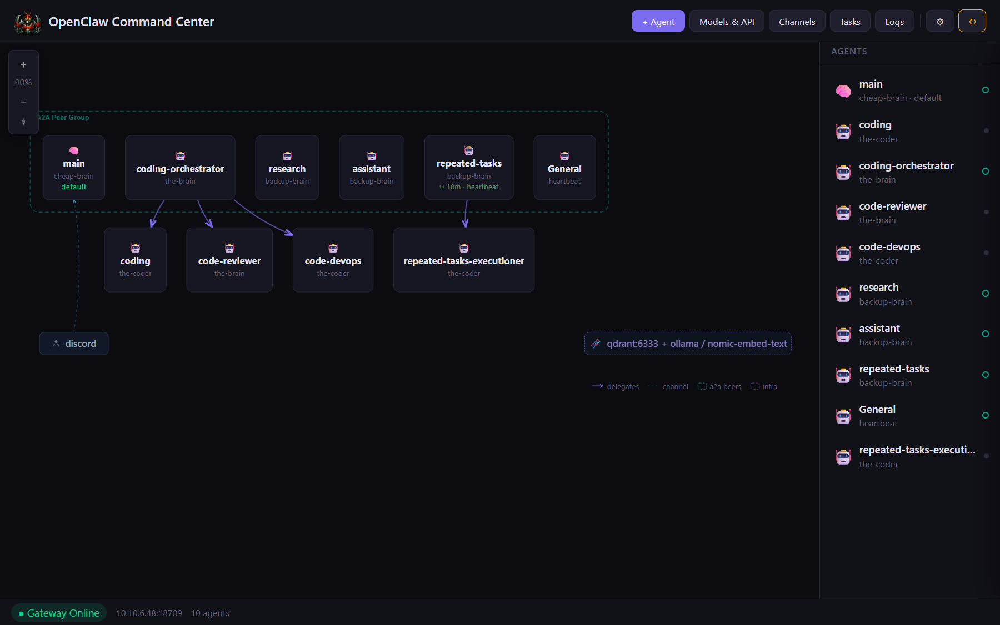
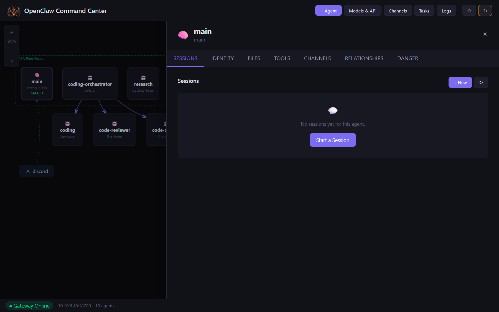
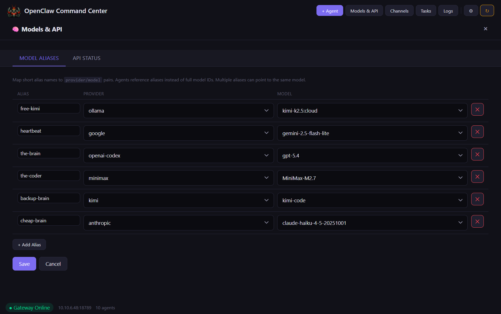
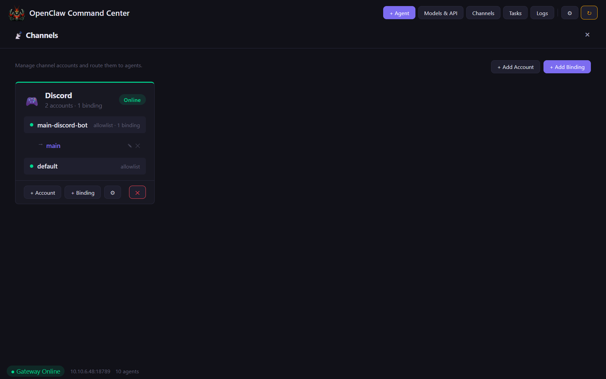
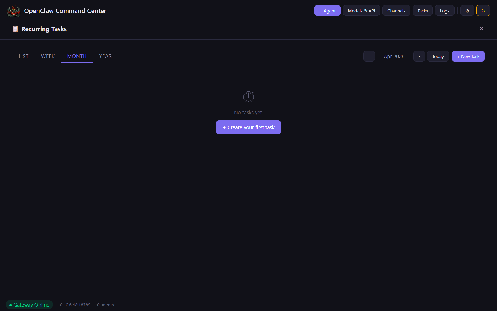
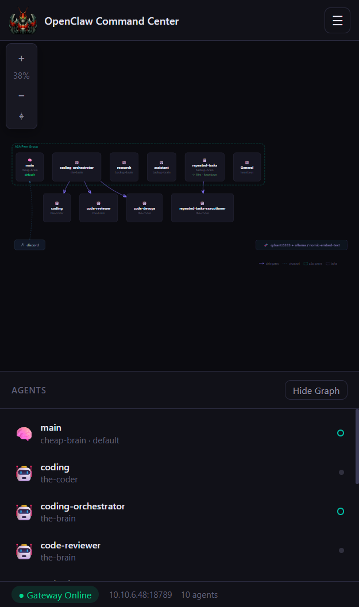
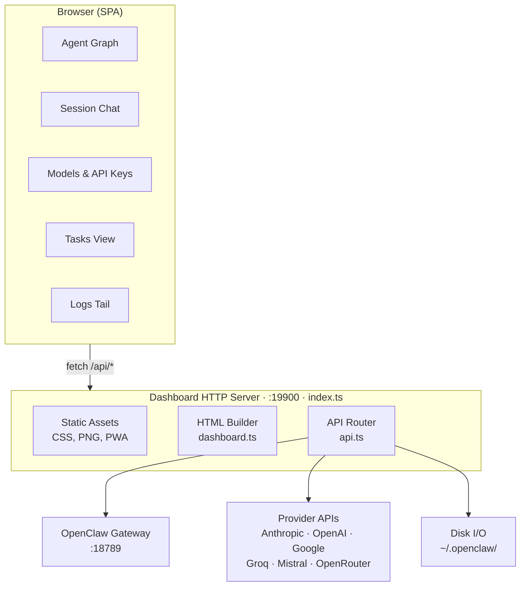

```
   ___                    ____ _
  / _ \ _ __   ___ _ __  / ___| | __ ___      __
 | | | | '_ \ / _ \ '_ \| |   | |/ _` \ \ /\ / /
 | |_| | |_) |  __/ | | | |___| | (_| |\ V  V /
  \___/| .__/ \___|_| |_|\____|_|\__,_| \_/\_/
       |_|           Agent Dashboard v1.0
```

A standalone dashboard plugin for [OpenClaw](https://github.com/openclaw) that gives you
full visibility and control over your agents, sessions, provider keys, channels, tasks,
and configuration — all from a single browser tab.



---

## Features

- Interactive relationship graph with pan, zoom, and pinch-to-zoom on mobile
- Agent management — create, edit, delete, configure models, tools, and workspace files
- Session management — spawn sessions, chat through the gateway, view history
- Models & API status — live probe of every provider (keys, OAuth, rate limits, billing)
- Channel management — Discord, Telegram, Slack, WhatsApp, Signal, and more
- Recurring tasks and heartbeat schedules with calendar views
- Full raw JSON config editor with validation
- Live log tailing via SSE
- Health checks with dismissable banners for invalid keys and rate limits
- PWA support — add to home screen on iOS and Android
- Fully responsive — works on desktop and mobile

### Agent drawer

Click any agent to open a slide-over panel with sessions, identity files, tools,
channel bindings, relationships, and danger-zone actions.



### Models & API

Live status of all configured providers. Map short aliases to provider/model pairs
so agents reference aliases instead of full model IDs.



### Channels

Manage messaging channel accounts and route them to agents.



### Tasks

Recurring tasks with list, week, month, and year calendar views.



### Mobile

Fully responsive with a hamburger menu, collapsible graph, and touch-friendly controls.



---

## Architecture




## Source Layout

```
src/
├── index.ts              Entry point — HTTP server, static assets, plugin registration
├── api.ts                All /api/* route handlers (agents, sessions, config, auth, health)
├── dashboard.ts          HTML builder — assembles the single-page app shell
├── dashboard.js.txt      Client-side JS (vanilla, no framework) — inlined into the HTML
├── dashboard.css         All styles — dark theme, responsive, mobile-first
├── resolve-asset.ts      Shared asset path resolver (works under jiti, tsc, and raw node)
├── index.test.ts         Vitest unit tests for plugin registration
├── favicon.png           Browser tab icon
├── logo.png              Dashboard header logo
└── ios_icon.png          PWA / iOS home screen icon
```

---

The dashboard exposes its own REST API under `/api/*` for scripting and integration.
See [API_REFERENCE.md](API_REFERENCE.md) for the full endpoint list.

---

## Installation

```bash
# Link for local development
openclaw plugins install -l ./path/to/openclaw-agent-dashboard

# Or copy-install
openclaw plugins install ./path/to/openclaw-agent-dashboard
```

## Configuration

Add to your `~/.openclaw/openclaw.json`:

```json
{
  "plugins": {
    "entries": {
      "agent-dashboard": {
        "enabled": true,
        "config": {
          "port": 19900,
          "title": "OpenClaw Command Center"
        }
      }
    }
  }
}
```

| Option           | Default                    | Description                                      |
|------------------|----------------------------|--------------------------------------------------|
| `port`           | `19900`                    | HTTP port for the dashboard server               |
| `title`          | `OpenClaw Command Center`  | Page title and PWA name                          |
| `allowedOrigins` | `[]`                       | Extra origins allowed to call the API (e.g. `["http://10.10.6.48:19900"]`) |

Restart the gateway, then open: **http://localhost:19900**

On first load you'll be prompted to create a username and password. These are stored
(hashed with scrypt) in `~/.openclaw/extensions/openclaw-agent-dashboard/.credentials`.
All subsequent visits and API calls require authentication — either via the browser
session cookie or a `Bearer` token in the `Authorization` header.

---

## Security

The dashboard protects itself at two layers:

- Authentication — every request (HTML pages and `/api/*` routes) requires a valid
  session. API clients like `curl` can authenticate with `Authorization: Bearer <token>`
  (the token is returned by `POST /auth/login`).
- Origin restriction — cross-origin requests are blocked unless the origin is in the
  `allowedOrigins` list. Same-origin and non-browser requests (no `Origin` header) are
  allowed through once authenticated.

If you need to reset credentials, delete the credentials file and reload the dashboard
to run setup again:

```bash
rm ~/.openclaw/extensions/openclaw-agent-dashboard/.credentials
```

---

## Development

```bash
npm install
npm run build      # compile TypeScript to dist/
npm run dev        # watch mode
npm test           # run vitest
```

The dashboard serves `dashboard.js.txt` and `dashboard.css` from the `src/` directory
at runtime, so CSS and client JS changes don't require a rebuild — just refresh the
browser. Only changes to `*.ts` files need a `tsc` rebuild.

---

## License

MIT
