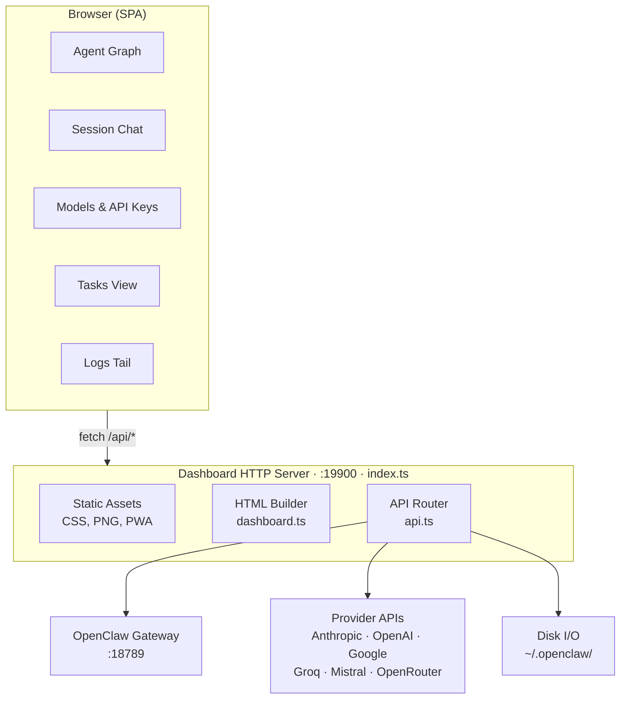

# Architecture

## Overview

The dashboard is a single-page application served by its own HTTP server that runs
as an OpenClaw plugin. It has no build-time frontend framework — the client-side JS
is vanilla JavaScript inlined into the HTML at serve time.



## How it works

1. The gateway loads the plugin from `dist/index.js` via `openclaw.plugin.json`.
2. `index.ts` starts a standalone HTTP server on the configured port (default 19900).
3. On every request to `/`, `dashboard.ts` builds the full HTML page — it reads
   `dashboard.js.txt` (client JS) and inlines it into a `<script>` tag. CSS is served
   separately at `/dashboard.css` and read fresh from disk on each request.
4. The client JS calls `/api/overview` on load to fetch agents, config, sessions, and
   gateway status, then renders the relationship graph and agent list.
5. All mutations (create/edit/delete agents, update config, send messages) go through
   `/api/*` routes in `api.ts`, which read/write files under `~/.openclaw/` and proxy
   chat requests to the gateway at `:18789`.

## Authentication

`auth.ts` handles credential storage and session management:

- Credentials are stored in `~/.openclaw/extensions/openclaw-agent-dashboard/.credentials`
  with passwords hashed using scrypt.
- Sessions are in-memory tokens with a 24-hour TTL, delivered via `HttpOnly` cookies.
- API clients can authenticate with `Authorization: Bearer <token>`.
- On first load with no credentials file, the setup page is shown.

## Source layout

```
src/
├── index.ts              Entry point — HTTP server, static assets, plugin registration
├── api.ts                All /api/* route handlers
├── auth.ts               Authentication — credentials, sessions, login/setup pages
├── dashboard.ts          HTML builder — assembles the SPA shell
├── dashboard.js.txt      Client-side JS (vanilla, no framework) — inlined into HTML
├── dashboard.css          Styles — dark theme, responsive
├── resolve-asset.ts      Asset path resolver
├── index.test.ts         Vitest unit tests
├── favicon.png           Browser tab icon
├── logo.png              Header logo
└── ios_icon.png          PWA / iOS home screen icon
```

## Data flow

- Config: `~/.openclaw/openclaw.json` — read/written by the config editor
- Agent state: `~/.openclaw/agents/<id>/` — workspace markdown files, sessions
- Dashboard state: `~/.openclaw/extensions/openclaw-agent-dashboard/` — dashboard
  config, session store, credentials
- Provider probes: API calls to Anthropic, OpenAI, Google, Groq, Mistral, OpenRouter
  to check key validity, rate limits, and available models
